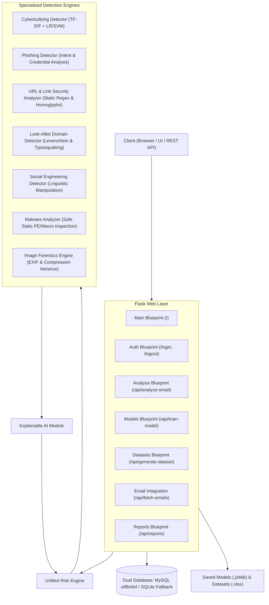

# BullyMail V2 — Architecture & Technical Design Document

This document provides a detailed overview of the system architecture, data models, threat detection pipeline, and integration workflows of **BullyMail V2**.

---

## 1. System Overview & Modular Structure

BullyMail V2 replaces the legacy monolithic structure with a modular, service-oriented architecture centered around the **Unified Risk Engine** and **Explainable AI (XAI)** subsystem.

---

## 2. Detection Pipeline & Data Flow

When an email is submitted for inspection (via direct submission, file upload, or automated IMAP ingestion):

1. **Input Normalization:**
   - Contractions are expanded.
   - URLs, email addresses, and attachments are safely parsed into structured objects without executing payloads or visiting links.

2. **Parallel Subsystem Analysis:**
   - **URL Analyzer:** Extracts all web links and inspects for IP hostnames, URL shorteners, punycode, non-standard ports, and credential paths.
   - **Domain Detector:** Checks sender address and links against protected brand baselines for character substitutions (e.g., `paypa1.com`) or subdomains.
   - **Phishing Detector:** Scans for credential harvesting requests, account locking pretexts, and sender vs. display-name spoofing.
   - **Bullying Detector:** Preprocesses text, applies TF-IDF vectorization, runs ML inference, and correlates with calibrated academic power-imbalance rules.
   - **Social Engineering Detector:** Scans for psychological triggers: authority impersonation, urgency/time pressure, intimidation, and financial extortion.
   - **Malware Analyzer:** Inspects uploaded files statically for double extensions (`.pdf.exe`), PE binary signatures (`MZ`), and macro APIs.
   - **Image Forensics Engine:** Inspects image EXIF metadata and analyzes compression variance across regions.

3. **Unified Risk Engine Aggregation:**
   - Evaluates composite threat score:
     $$\text{Composite Score} = (0.30 \times \text{Phishing}) + (0.25 \times \text{Bullying}) + (0.20 \times \text{URL}) + (0.15 \times \text{Malware}) + (0.10 \times \text{SocialEng})$$
   - Applies peak override for critical individual findings.
   - Maps score to `LOW`, `MEDIUM`, `HIGH`, or `CRITICAL`.

4. **Explainable AI (XAI) Synthesis:**
   - Generates human-readable evidence cards detailing the exact reasons, tokens, and severity of each finding.

5. **Persistence & Reporting:**
   - Stores the structured report in `analyzed_emails` table.
   - Provides standalone printable HTML/PDF reports and CSV exports.

---

## 3. Database Architecture (UTF-8 / utf8mb4)

The database schema supports rich threat metadata:
- **`users`:** Stores usernames and secure PBKDF2/SHA256 password hashes.
- **`analyzed_emails`:** Stores subject, sender, body, overall risk level, confidence, individual scores for all 6 vectors, and JSON evidence summaries.
- **`model_history`:** Stores model type, precision, recall, F1, accuracy, and confusion matrix JSON for auditability.
- **`dataset_history`:** Tracks dataset generation logs.
- **`email_config`:** Tracks IMAP/SMTP integration state.
