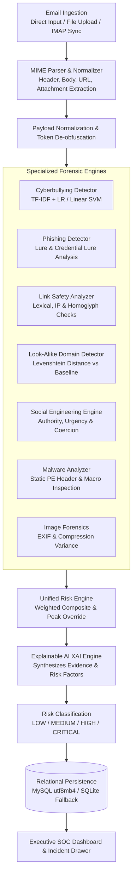

# BullyMail V2 — Threat Intelligence & Email Security Platform

[](https://www.python.org/)
[](https://flask.palletsprojects.com/)
[]()
[]()
[]()

BullyMail V2 is an enterprise-grade email security and threat-intelligence platform engineered to ingest institutional communications, inspect multi-vector security signals, classify risk through a calibrated fusion engine, and present actionable digital forensics through a Security Operations Center (SOC) command workstation.

---

## 1. Project Overview

Academic institutions, enterprise networks, and collaborative workspaces face a compounding convergence of email-borne threats ranging from targeted cyberbullying and harassment to sophisticated phishing lures, malicious links, typosquatted look-alike domains, psychological social engineering, and dangerous file attachments.

BullyMail V2 addresses these challenges by replacing legacy single-vector keyword filters with a modular, service-oriented multi-engine architecture:
- Ingests institutional communications via manual submission, file intake (`.eml`, `.msg`, `.txt`), or live background IMAP mailbox synchronization.
- Executes parallel forensic inspection across specialized threat analysis engines.
- Aggregates multi-vector indicators using a transparent, explainable composite-and-peak risk fusion model.
- Persists all forensic telemetry, raw indicators, and machine learning evaluations to a structured MySQL relational schema (with transparent SQLite local fallback).
- Delivers real-time posture assessments, live threat feeds, and deep-dive incident inspection drawers via an interactive, responsive SOC mission control interface.

---

## 2. Key Features

### Security Operations Center (SOC) Command Center
- **Executive Telemetry Strip:** Real-time metrics tracking Total Ingested Scans, Threats Flagged, Critical Incidents, Active Monitored Vectors, and Synchronized Telemetry timestamps.
- **Threat Posture & Health Assessment:** Dynamic security posture scoring, active vector status indicators (`Cyberbullying`, `Phishing`, `Risky Links`, `Malware Risk`, `Social Engineering`), and stacked severity distribution profiling.
- **Ingestion & Threat Velocity Trend:** Interactive time-series visualization tracking baseline communication traffic against high/critical threat velocity over time.
- **Multi-Vector Threat Analytics:** Ranked multi-vector distribution detailing incident share, volume metrics, and dominant threat surface identification.
- **Current Threat Signal Intelligence:** Automated analyst briefing summarizing dominant attack vectors, severity profiles, channel statuses, and plain-English narrative interpretations.
- **Live Forensic Event Ledger:** Real-time event stream featuring severity badges, vector identifiers, sender details, subject previews, confidence bars, and single-click incident drawer triggers.
- **True Collapsible Navigation Rail:** High-density navigation bar supporting seamless full-state collapse (`260px` to `72px`), icon-only mode with tooltips, full-width responsive workspace reflow, and persistent state across sessions.

### Multi-Vector Threat Detection Pipeline
- **Cyberbullying & Harassment Engine:** Natural Language Processing (NLP) pipeline combining TF-IDF feature extraction (`ngram_range=(1,2)`, `max_features=4000`) with calibrated Logistic Regression and Linear Support Vector Machines (SVM). Features exponential rule matching, severity tiering (`MEDIUM`, `HIGH`, `CRITICAL`), and adversarial token normalization against leetspeak, spacing, and character substitution evasions.
- **Phishing & Credential Theft Detector:** Identifies credential reset lures, urgent verification scams, account suspension threats, financial extortion patterns, and sender display-name vs. public webmail domain mismatches.
- **URL & Link Safety Analyzer:** Safe lexical URL parsing without outbound network navigation. Scans for raw IP addresses, URL shorteners, punycode/homoglyph characters, deep subdomain nesting, and suspicious credential path patterns.
- **Look-Alike & Typosquatting Detector:** Evaluates sender domains and embedded hyperlinks using Levenshtein distance calculations and homoglyph mapping against trusted institutional baselines.
- **Social Engineering Engine:** Detects psychological manipulation vectors including authority impersonation (e.g., Deans, IT administrators), urgency/time pressure, intimidation/fear tactics, financial coercion, and illicit reward traps.
- **Safe Static Malware & Attachment Analyzer:** Enforces a strict Zero-Execution guarantee. Inspects static binary magic headers (`MZ`/PE), double extensions (e.g., `invoice.pdf.exe`), embedded VBA/macro APIs (`Shell`, `AutoExec`), and calculates MD5 / SHA-256 cryptographic hashes.
- **Passive Image Forensics:** Extracts EXIF metadata, scans for digital editing software signatures (Photoshop, GIMP), and flags compression variance anomalies.
- **Explainable AI (XAI) & Incident Evidence:** Synthesizes granular, human-readable forensic evidence cards highlighting triggered indicators, keyword matches, and mitigating contextual factors.

### Secure Mailbox Operations & Background Ingestion
- **Institutional Mailbox Configuration:** Support for multi-institution mailbox management across custom IMAP/SMTP endpoints.
- **Encrypted Credential Storage:** AES-256 / Fernet key derivation for mailbox application passwords, ensuring plaintext credentials are never stored.
- **Distributed Lease-Based Synchronization:** Concurrency-safe synchronization workers utilizing lease IDs and expiration windows to prevent race conditions during parallel processing.
- **Idempotent Ingestion & Message Deduplication:** Tracking via SHA-256 message ID hashes and IMAP `UID`/`UIDVALIDITY` state to prevent duplicate processing.
- **Mailbox Inbox Explorer:** Dedicated mailbox viewing with full-text search, threat-level filtering, vector filtering, and deep forensic drawer integration.
- **Automated Background Daemon:** Standalone worker process (`bullymail/worker/daemon.py`) for scheduled mailbox polling and asynchronous batch threat processing.

### Multi-Tenancy & Access Governance
- **Role-Based Access Control (RBAC):** Tiered permissions across `admin`, `operator`, and `analyst` roles.
- **Institution / Workspace Scoping:** Strict workspace boundary filtering enforcing data access restrictions for analysts and operators while providing administrative cross-tenant oversight.
- **User Account Lifecycle:** User registration with cryptographic SHA-256 email verification tokens, self-service password reset flows, and an administrative approval queue for newly requested institutions.
- **Brute-Force Rate Limiting:** In-memory and database-backed failed login tracking with exponential account lockouts.

### Model & Dataset Studios
- **Model Studio:** Training and evaluation history viewer tracking precision, recall, F1-score, accuracy, and confusion matrix data for retrained classification models.
- **Dataset Studio:** Dataset repository manager tracking sample distributions, bullying vs. neutral ratios, and uploaded forensic corpora.

---

## 3. Threat Detection Architecture



---

## 4. Risk Classification & Scoring Formulation

BullyMail V2 implements a deterministic, explainable risk scoring algorithm within [`bullymail/services/risk_engine.py`](bullymail/services/risk_engine.py). It calculates both a **weighted composite score** across multiple attack vectors and a **peak critical override score**, gating the final threat category into calibrated severity tiers.

### Individual Vector Scores
Each detection engine produces a normalized score in the range $[0.0, 1.0]$:
- **Cyberbullying ($b$):** Model confidence score if bullying is detected ($0.0$ otherwise), with severity category $b_{\text{severity}} \in \{\text{LOW}, \text{MEDIUM}, \text{HIGH}, \text{CRITICAL}\}$.
- **Phishing ($p$):** Detection confidence score if risk $\neq \text{LOW}$ ($0.0$ otherwise).
- **URL / Link Safety ($u$):** $0.85$ for `HIGH_RISK`, $0.45$ for `SUSPICIOUS`, $0.0$ for `CLEAN`.
- **Malware / Attachment ($m$):** $0.95$ for `HIGH_RISK`, $0.45$ for `SUSPICIOUS`, $0.0$ for `CLEAN`.
- **Social Engineering ($s$):** Detection confidence score if risk $\neq \text{LOW}$ ($0.0$ otherwise).
- **Image Forensics ($i$):** $0.70$ for `HIGH`, $0.35$ for `MEDIUM`, $0.0$ for `CLEAN`.

### Scoring Formulas

1. **Weighted Composite Score:**
   $$\text{Composite} = (0.30 \cdot p) + (0.25 \cdot b) + (0.20 \cdot u) + (0.15 \cdot m) + (0.10 \cdot s)$$

2. **Peak Override Score:**
   $$\text{Peak} = \max(b, p, u, m, s, i)$$
   *(If look-alike domain spoofing is detected, $\text{Peak} = \max(\text{Peak}, 0.75)$).*

3. **Final Threat Score:**
   $$\text{Threat Score} = \text{round}(\max(\text{Composite}, \text{Peak}), 3)$$

### Threat Level Gating

| Risk Level | Trigger Criteria |
| :--- | :--- |
| **CRITICAL** | $b_{\text{severity}} == \text{CRITICAL}$ **OR** $\text{Threat Score} \ge 0.88$ **OR** $m \ge 0.90$ **OR** $p_{\text{risk}} == \text{CRITICAL}$ |
| **HIGH** | $b_{\text{severity}} == \text{HIGH}$ **OR** $\text{Threat Score} \ge 0.70$ **OR** $p \ge 0.70$ **OR** $s \ge 0.70$ **OR** $m \ge 0.70$ |
| **MEDIUM** | $b_{\text{severity}} == \text{MEDIUM}$ **OR** $\text{Threat Score} \ge 0.35$ |
| **LOW** | Baseline traffic satisfying none of the above threat thresholds |

---

## 5. Secure Mailbox Operations

BullyMail V2 features integrated institutional mailbox management:

1. **Configuration:** Administrators configure mailboxes with host server parameters (e.g., `imap.gmail.com`), port (`993` SSL), email address, and encrypted application credentials.
2. **IMAP Connectivity & Handshake:** Authenticates over TLS/SSL, selects the remote folder (`INBOX`), and tracks remote server state via `UIDVALIDITY`.
3. **Lease-Based Synchronization:** Before syncing, the system acquires an atomic sync lease (`sync_lease_id`, `sync_lease_expires_at`) to ensure only one worker processes a mailbox at a time.
4. **Message Ingestion & Parsing:** Fetches unread or recent messages via `RFC822` format, parses MIME multi-part structures, extracts plain text/HTML bodies, extracts inline links, and isolates attachments for static analysis.
5. **Deduplication:** Computes SHA-256 hashes of standard `Message-ID` headers to guarantee idempotent ingestion.
6. **Per-Mailbox Inboxes:** Allows analysts to view messages specifically ingested by that mailbox, filter by threat level or vector, and inspect full incident findings.

---

## 6. Security Architecture & Access Controls

- **Zero Execution Guarantee:** Uploaded attachments and binary files are strictly analyzed statically (PE headers, macro strings, file signatures). Files are never executed.
- **Safe URL Inspection:** URLs are analyzed lexically without making outbound HTTP/HTTPS network requests, eliminating server-side request forgery (SSRF) and malicious redirect execution.
- **Password Security:** PBKDF2/SHA-256 password hashing with unique per-user cryptographic salts via Werkzeug.
- **Brute-Force Defense:** Failed authentication attempts increment `failed_login_attempts` and trigger account lockout windows (`locked_until`).
- **Encrypted Credential Storage:** Mailbox passwords are encrypted at rest using AES-256 / Fernet key derivation (`BULLYMAIL_MASTER_KEY`).
- **Token Security:** Email verification and password reset tokens are hashed using SHA-256 before storage (`token_hash`) with enforced expiration and single-use invalidation.
- **Session Security:** Flask session cookies are configured with `HttpOnly=True` and `SameSite=Lax`.
- **Institution & Workspace Scoping:** Role-based access control restricts analysts and operators to their assigned institution (`institution_id`), while administrators possess system-wide management privileges.
- **Security Hardening Note:** Current multi-tenancy is enforced at the application data-access layer via institution foreign keys. Future production hardening will introduce separate database schemas/catalogs for high-assurance enterprise isolation.

---

## 7. Technology Stack

| Layer | Technologies |
| :--- | :--- |
| **Backend Core** | Python 3.8+, Flask 2.x, Werkzeug, Waitress WSGI Server |
| **Database** | MySQL 8.0 / 5.7 (`mysql-connector-python`, `utf8mb4`), SQLite (automatic fallback) |
| **Machine Learning & NLP** | scikit-learn, joblib, NLTK, Pandas, NumPy |
| **Email & Protocols** | Python `imaplib`, `email` (MIME parsing), `ssl` |
| **File & Image Forensics** | Pillow (PIL), hashlib, Exif metadata analysis |
| **Frontend & UI** | HTML5, CSS3 (Enterprise SOC Custom Design System), Vanilla JS (ES6+), Font Awesome 6, Chart.js |
| **Testing & Quality** | Pytest, Faker |

---

## 8. Database Architecture

BullyMail V2 operates with a structured relational schema consisting of **9 primary tables**:

```
+----------------------------+
|        institutions        |  <-- Organization / Tenant Boundaries
+----------------------------+
              |
              +--------------------------+
              |                          |
+----------------------------+  +----------------------------+
|           users            |  |        email_config        |  <-- Mailbox Connections
+----------------------------+  +----------------------------+
       |              |                        |
       |              |                        v
       |              |         +----------------------------+
       |              |         |      ingested_messages     |  <-- Deduplicated IMAP State
       |              |         +----------------------------+
       |              |                        |
       v              v                        v
+--------------+ +--------------+ +----------------------------+
| email_verif_ | | pass_reset_  | |      analyzed_emails       |  <-- Forensic Analysis Ledger
|    tokens    | |    tokens    | +----------------------------+
+--------------+ +--------------+
```

### Table Descriptions

1. **`institutions`**: Defines multi-tenant organizational boundaries, domains, codes, and operational status.
2. **`users`**: Manages user accounts, PBKDF2 password hashes, roles (`admin`, `operator`, `analyst`), institution associations, verification statuses, and brute-force lockout timestamps.
3. **`email_verification_tokens`**: Stores SHA-256 token hashes, expiration timestamps, and usage tracking for user registration verification.
4. **`password_reset_tokens`**: Stores SHA-256 token hashes for secure self-service password recovery workflows.
5. **`email_config`**: Stores institutional mailbox integration settings, IMAP/SMTP endpoints, encrypted application passwords, sync leases, error logs, and ingestion counters.
6. **`ingested_messages`**: Tracks IMAP message discovery, duplicate avoidance via SHA-256 message ID hashes, processing statuses (`DISCOVERED`, `PROCESSING`, `ANALYZED`, `FAILED`), and retry attempts.
7. **`analyzed_emails`**: Primary forensic ledger storing multi-vector threat scores, risk categories (`LOW`, `MEDIUM`, `HIGH`, `CRITICAL`), confidence ratings, vector-specific sub-reports, and Explainable AI factors.
8. **`model_history`**: Records machine learning model performance evaluation logs (precision, recall, F1-score, accuracy, confusion matrix metrics).
9. **`dataset_history`**: Tracks training/evaluation datasets (sample counts, class distributions, file sizes).

---

## 9. Project Structure

```
BullyMail-V2/
├── app.py                          # Flask application entry point
├── config.py                       # Root configuration loader
├── database_setup.sql              # Production MySQL initialization script
├── requirements.txt                # Python package dependencies
├── .env.example                    # Environment variable template
│
├── bullymail/                      # Core Application Package
│   ├── __init__.py                 # Application factory (create_app)
│   ├── config.py                   # Centralized configuration & environment parser
│   ├── database/                   # Database Layer
│   │   ├── connection.py           # Dual-engine connection pool (MySQL + SQLite)
│   │   └── schema.py               # DDL schema definitions & migrations
│   ├── models/                     # Data Access Objects (DAOs)
│   │   ├── analysis.py             # Analyzed email persistence & queries
│   │   ├── ingested_message.py     # IMAP ingestion state management
│   │   ├── institution.py          # Tenant & institution management
│   │   └── user.py                 # User authentication & RBAC models
│   ├── routes/                     # Modular Flask Blueprints
│   │   ├── admin.py                # Admin user management & approvals
│   │   ├── analysis.py             # Manual submission & quick analysis APIs
│   │   ├── auth.py                 # Authentication, signup & token endpoints
│   │   ├── datasets.py             # Dataset management endpoints
│   │   ├── email_integration.py    # Mailbox configuration & inbox endpoints
│   │   ├── main.py                 # Main view routing
│   │   ├── models.py               # Model studio & training endpoints
│   │   └── reports.py              # PDF/CSV audit export routes
│   ├── services/                   # Forensic Detection & Security Engines
│   │   ├── auth_email_service.py   # Verification & reset email dispatch
│   │   ├── auth_token_service.py   # Cryptographic token generation & validation
│   │   ├── bullying_detector.py    # NLP TF-IDF + Logistic Regression / SVM engine
│   │   ├── crypto_service.py       # AES-256 / Fernet credential encryption
│   │   ├── domain_detector.py      # Look-alike & typosquatting analysis
│   │   ├── email_service.py        # Mailbox synchronization management
│   │   ├── explainable_ai.py       # Explainable AI (XAI) evidence synthesizer
│   │   ├── image_forensics.py      # EXIF & image anomaly analyzer
│   │   ├── imap_client.py          # Secure IMAP client implementation
│   │   ├── malware_analyzer.py     # Safe static PE & macro analyzer
│   │   ├── mime_parser.py          # RFC822 MIME multi-part parser
│   │   ├── phishing_detector.py    # Phishing & credential theft detector
│   │   ├── preprocessor.py         # Text cleaner & adversarial de-obfuscator
│   │   ├── rate_limiter.py         # Login brute-force rate limiter
│   │   ├── report_generator.py     # Forensic summary report compiler
│   │   ├── risk_engine.py          # Unified multi-vector risk fusion engine
│   │   ├── social_engineering.py   # Social engineering & coercion detector
│   │   └── url_analyzer.py         # Lexical link safety & homoglyph detector
│   └── worker/                     # Background Synchronization Worker
│       ├── daemon.py               # Scheduled background polling daemon
│       └── processor.py            # Mailbox batch ingestion processor
│
├── saved_models/                   # Serialized ML models (.joblib) & vectorizers
├── static/                         # Static Web Assets
│   ├── css/                        # Custom Enterprise SOC Stylesheets (dashboard.css)
│   ├── js/                         # Modular Frontend Controllers (dashboard.js)
│   └── favicon.svg                 # Application favicon
├── templates/                      # Jinja2 HTML Templates
│   ├── dashboard.html              # Main SOC Command Center interface
│   ├── login.html                  # Secure authentication portal
│   └── ...                         # Supporting templates
└── tests/                          # Automated Pytest Test Suite
    ├── test_api_routes.py          # REST API route validation
    ├── test_auth_lifecycle.py      # Authentication & token verification tests
    ├── test_mailbox_inbox_isolation.py # Mailbox isolation & synchronization tests
    ├── test_tenant_isolation.py    # Multi-tenant boundary & IDOR security tests
    └── ...                         # Engine-specific unit tests
```

---

## 10. Testing & Verification

BullyMail V2 includes automated test coverage powered by **Pytest**.

### Test Suite Execution
```powershell
# Run complete test suite with SQLite test database
$env:DB_TYPE="sqlite"
pytest tests/test_api_routes.py tests/test_mailbox_inbox_isolation.py tests/test_tenant_isolation.py tests/test_auth_lifecycle.py -v
```

### Verified Test Results
- **API Routes (`test_api_routes.py`):** 9 / 9 passed (Homepage, auth status, quick demo analysis, system stats).
- **Mailbox Inbox Isolation (`test_mailbox_inbox_isolation.py`):** 12 / 12 passed (Inbox scoping, IDOR protection, sync leases, message deduplication).
- **Tenant Isolation & RBAC (`test_tenant_isolation.py`):** 14 / 14 passed (Cross-institution query protection, audit access controls, tenant inheritance).
- **Authentication Lifecycle (`test_auth_lifecycle.py`):** 13 / 13 passed (PBKDF2 validation, brute-force lockout, email verification tokens, password reset invalidation).
- **Total Passing Tests:** **48 / 48 passed (100% success rate)**.

---

## 11. Running Locally

### Prerequisites
- Python 3.8 to 3.11 installed.
- (Optional) MySQL Server 5.7+ or 8.0+ (SQLite fallback operates automatically if MySQL is unavailable).

### Windows PowerShell Setup

1. **Clone Repository & Navigate:**
   ```powershell
   git clone https://github.com/jayachandra2003/BullyMail-Threat-Intelligence.git
   cd "Email Bullying Detection_Final_Code"
   ```

2. **Create & Activate Virtual Environment:**
   ```powershell
   python -m venv venv
   .\venv\Scripts\Activate.ps1
   ```

3. **Install Dependencies:**
   ```powershell
   pip install -r requirements.txt
   ```

4. **Configure Environment Variables:**
   Copy the `.env.example` file to `.env`:
   ```powershell
   Copy-Item .env.example .env
   ```

5. **Start BullyMail V2 Application:**
   ```powershell
   # For MySQL Deployment:
   $env:DB_TYPE="mysql"
   python app.py

   # Or for SQLite Local Mode:
   $env:DB_TYPE="sqlite"
   python app.py
   ```

6. **Access SOC Interface:**
   Open your browser and navigate to: **`http://localhost:5000`** (or configured port).

---

## 12. MySQL Configuration

To configure BullyMail V2 with a MySQL database instance, set the following environment variables in `.env`:

```env
# Application Settings
FLASK_ENV=development
SECRET_KEY=your_secure_random_secret_key_here
BULLYMAIL_MASTER_KEY=your_base64_master_encryption_key_here

# Database Configuration (MySQL)
DB_TYPE=mysql
DB_HOST=localhost
DB_PORT=3306
DB_NAME=bullymail_db
DB_USER=your_mysql_username
DB_PASSWORD=your_mysql_password

# Initial Administrator Provisioning
ADMIN_USERNAME=admin
ADMIN_PASSWORD=your_initial_admin_password
```

### Initializing Database Schema (Optional Manual Run)
```powershell
# Execute the database setup script in MySQL
mysql -u your_mysql_username -p bullymail_db < database_setup.sql
```
*(Note: If tables do not exist, `bullymail/database/schema.py` automatically initializes and migrates all 9 tables upon application startup).*

---

## 13. Demonstration Workflow

1. **Authentication:** Log into the SOC platform using your administrator credentials at `/login`.
2. **Executive Command Center:** View real-time security posture, active vector indicators, telemetry counters, and ingestion trend charts.
3. **Secure Mailbox Integration:** Navigate to `Integration -> Secure Mailbox`, add an institutional mailbox with IMAP credentials, and initiate a `Sync`.
4. **Inbox Inspection:** Browse the ingested email ledger, filter by specific threat vectors (Cyberbullying, Phishing, Links), and search message content.
5. **Forensic Incident Drawer:** Click `Inspect` on any flagged incident to open the slide-out digital forensics drawer, viewing extracted URLs, malicious findings, and Explainable AI evidence summaries.
6. **Threat Analyzer:** Navigate to `Investigate -> Threat Analyzer` to manually test raw email bodies, headers, or file attachments against the multi-vector detection pipeline.
7. **Audit Reporting:** Export comprehensive forensic summaries as printable reports or CSV records for incident response archiving.

---

## 14. Limitations & Future Roadmap

### Current Scope & Architecture Notes
- **Application-Layer Tenant Isolation:** Tenant scoping is enforced at the application query layer using `institution_id` references.
- **Static File Inspection:** File attachments are analyzed via static signature analysis and magic headers without a dynamic sandboxed execution environment.

### Future Roadmap
- [ ] Direct API integrations for Google Workspace (OAuth2) and Microsoft 365 (Microsoft Graph API).
- [ ] Distributed message queue architecture (Redis / Celery) for high-throughput enterprise mailbox processing.
- [ ] Isolated microservices architecture with separate database schemas per enterprise tenant.
- [ ] Sandboxed dynamic analysis runner (Cuckoo Sandbox / Dockerized sandbox) for attachment behavioral detonation.
- [ ] Enterprise SIEM integrations (Syslog, Splunk, Elastic Common Schema export).

---

## 15. Disclaimer & Security Notes

> **Disclaimer:** BullyMail V2 is an educational capstone project and threat intelligence research platform. It is designed for security analysis, harassment mitigation, and forensic monitoring. Never deploy into production environments with default secret keys or unencrypted master credentials.

---

## 16. Author & License

- **Project:** BullyMail V2 — Threat Intelligence & Email Security Platform
- **Repository:** `jayachandra2003/BullyMail-Threat-Intelligence`
- **License:** Open-source under the [MIT License](LICENSE).
